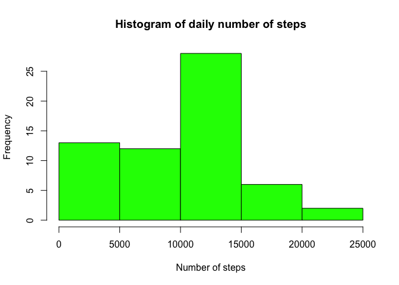
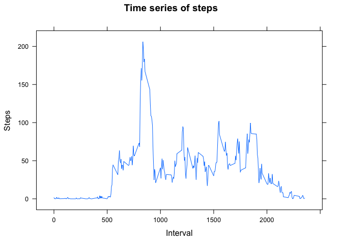
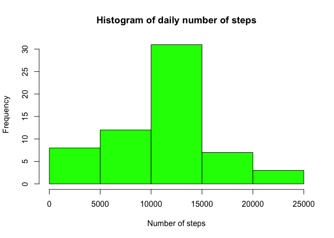
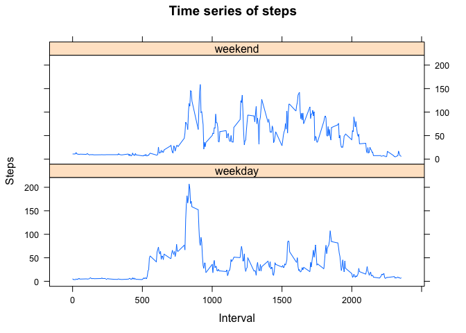

# Reproducible Research: Peer Assessment 1


## Loading and preprocessing the data
First, we should unzip and read data into variable.


```r
unzip('activity.zip')
act <- read.csv('activity.csv')
```

## What is mean total number of steps taken per day?
We should first calculate total number of steps per day and then plot a histogram using this data.


```r
sums <- aggregate(act$steps, by = list(act$date), sum, na.rm = TRUE)
hist(sums$x, xlab = 'Number of steps', col = 'green', main = 'Histogram of daily number of steps')
```

 

```r
meanSteps <- mean(sums$x, na.rm = TRUE)
medianSteps <- median(sums$x, na.rm = TRUE)
```

So mean is 9354.2295082 and median is 10395.

## What is the average daily activity pattern?

```r
library(lattice)
means <- aggregate(act$steps, by = list(act$interval), mean, na.rm = TRUE)
xyplot(means$x ~ means$Group.1, type = 'l', , xlab = 'Interval', ylab = 'Steps', main = 'Time series of steps')
```

 

```r
maxInt <- means[[which.max(means$x), 1]]
```

Interval with maximal average number of steps is 835.

## Imputing missing values
First, let's calculate the number of observations with missing data.


```r
sum(is.na(act$steps))
```

```
## [1] 2304
```

Now we can use our set of averages on intervals to fill in the blanks


```r
actNew <- act
nums <- which(is.na(actNew))
n <- merge(actNew[nums, 1:3], means, by.x = 'interval', by.y = 'Group.1')
actNew[nums, 1] <- n$x

sumsNew <- aggregate(actNew$steps, by = list(actNew$date), sum, na.rm = TRUE)
hist(sumsNew$x, xlab = 'Number of steps', col = 'green', main = 'Histogram of daily number of steps')
```

 

```r
meanSteps <- mean(sumsNew$x, na.rm = TRUE)
medianSteps <- median(sumsNew$x, na.rm = TRUE)
```

So new mean is 1.0766189\times 10^{4} and new median is 1.1015\times 10^{4}.  
Mean and median increased and the histogram changed.

## Are there differences in activity patterns between weekdays and weekends?
We need to split all days into weekends or weekdays and take separate averages.  
Then we can combine results and plot them to compare.


```r
weekdate <- as.POSIXlt(act$date)
weekdaten <- (weekdate$wday %in% c(6,0))
f <- factor(weekdaten, labels = c('weekday', 'weekend'))
weekends <- which(f == 'weekend')
weekdays <- which(f == 'weekday')
meansWeekday <- aggregate(actNew[weekdays, 1:3]$steps, by = list(act[weekdays, 1:3]$interval), mean, na.rm = TRUE)
meansWeekend <- aggregate(actNew[weekends, 1:3]$steps, by = list(act[weekends, 1:3]$interval), mean, na.rm = TRUE)
meansWeekday$day <- rep('weekday')
meansWeekend$day <- rep('weekend')
meansDays <- rbind(meansWeekday, meansWeekend)
xyplot(meansDays$x ~ meansDays$Group.1 | meansDays$day, type = 'l', , xlab = 'Interval', ylab = 'Steps', main = 'Time series of steps', layout = c(1,2))
```

 

